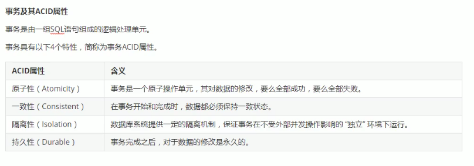
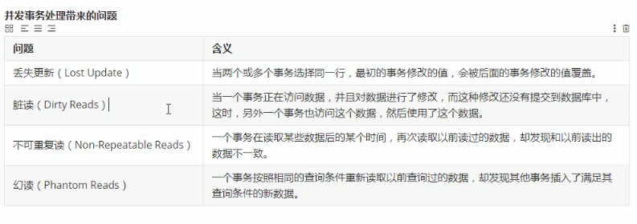
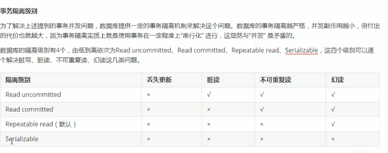

### 事务

MySQL 事务主要用于处理操作量大，复杂度高的数据。比如说，在人员管理系统中，你删除一个人员，你既需要删除人员的基本资料，也要删除和该人员相关的信息，如信箱，文章等等，这样，这些数据库操作语句就构成一个事务！

在 MySQL 中只有使用了 Innodb 数据库引擎的数据库或表才支持事务。

事务处理可以用来维护数据库的完整性，保证成批的 SQL 语句要么全部执行，要么全部不执行。

事务用来管理 insert,update,delete 语句

一般来说，事务是必须满足4个条件（ACID）：
+ 原子性（Atomicity，或称不可分割性）、
+ 一致性（Consistency）、
+ 隔离性（Isolation，又称独立性）、
+ 持久性（Durability）。

原子性：一个事务（transaction）中的所有操作，要么全部完成，要么全部不完成，不会结束在中间某个环节。事务在执行过程中发生错误，会被回滚（Rollback）到事务开始前的状态，就像这个事务从来没有执行过一样。

一致性：在事务开始之前和事务结束以后，数据库的完整性没有被破坏。这表示写入的资料必须完全符合所有的预设规则，这包含资料的精确度、串联性以及后续数据库可以自发性地完成预定的工作。

隔离性：数据库允许多个并发事务同时对其数据进行读写和修改的能力，隔离性可以防止多个事务并发执行时由于交叉执行而导致数据的不一致。事务隔离分为不同级别，包括读未提交（Read uncommitted）、读提交（read committed）、可重复读（repeatable read）和串行化（Serializable）。

持久性：事务处理结束后，对数据的修改就是永久的，即便系统故障也不会丢失。

 
### 并发事务带来的问题

### 事务隔离级别

Read uncommitted 读未提交

Read committed   读已提交

Repeatable read  可重复读

Serializable     串行化

InnoDB 默认的隔离级别是 Repeatable read;

查看事务隔离级别

    show variables like "tx_isolation";

mysql 版本 >= 8.0

    select @@transaction_isolation;

    set session transaction isolation level serializable;

