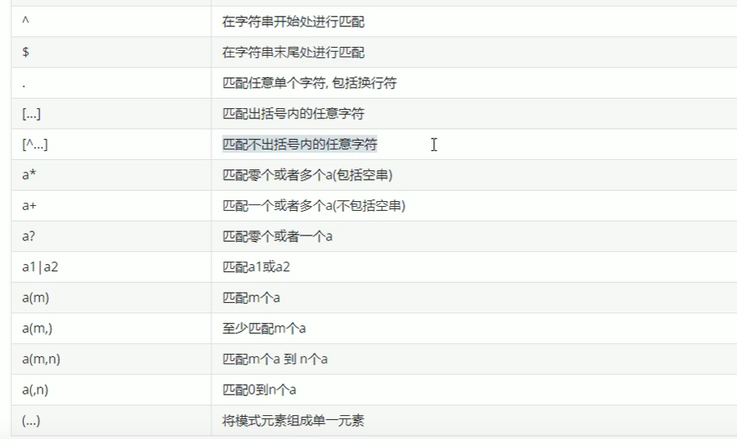

SQL 技巧

编写顺序
```SQL
SELECT DISTINCT
    <select list>
FROM
    <left table><join type>
JOIN
    <right_table> ON <join_condition>
WHERE
    <where_condition>
GROUP BY 
    <group_by_list>
HAVING  
    <having_condition>
ORDER BY  
    <order_by_condition>
LIMIT
    <limit_params>
```

执行顺序

```SQL
FROM <left table>
ON <join_condition>
<join type> JOIN <right_table>
WHERE <where_condition>
GROUP BY  <group_by_list>
HAVING <having_condition>
SELECT DISTINCT  <select list>
ORDER BY  <order_by_condition>
LIMIT <limit_params>
```

正则表达式 regexp


