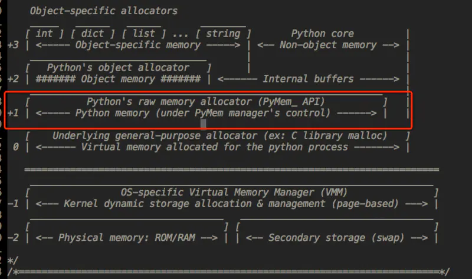

内存管理与垃圾回收机制

---

Python 的内存管理机制及调优手段？
内存管理机制：引用计数、垃圾回收、内存池。

### 引用计数：

引用计数是一种非常高效的内存管理手段， 当一个 Python 对象被引用时其引用计数增加 1， 当其不再被一个变量引用时则计数减 1. 当引用计数等于 0 时对象被删除。

### 垃圾回收 ：

#### 1.引用计数

引用计数也是一种垃圾收集机制，而且也是一种最直观，最简单的垃圾收集技术。当 Python 的某个对象的引用计数降为 0 时，说明没有任何引用指向该对象，该对象就成为要被回收的垃圾了。比如某个新建对象，它被分配给某个引用，对象的引用计数变为 1。如果引用被删除，对象的引用计数为 0， 那么该对象就可以被垃圾回收。不过如果出现循环引用的话，引用计数机制就不再起有效的作用了

#### 2.标记清除

如果两个对象的引用计数都为 1，但是仅仅存在他们之间的循环引用，那么这两个对象都是需要被回收的，也就是说，它们的引用计数虽然表现为非 0，但实际上有效的引用计数为 0。所以先将循环引用摘掉，就会得出这两个对象的有效计数。

#### 3.分代回收

从前面“标记-清除”这样的垃圾收集机制来看，这种垃圾收集机制所带来的额外操作实际上与系统中总的内存块的数量是相关的，当需要回收的内存块越多时，垃圾检测带来的额外操作就越多，而垃圾回收带来的额外操作就越少；反之，当需回收的内存块越少时，垃圾检测就将比垃圾回收带来更少的额外操作。

### 调优手段（了解）

1. 手动垃圾回收
2. 调高垃圾回收阈值
3. 避免循环引用（手动解循环引用和使用弱引用）

### 内存池

Python的内存机制呈现金字塔形状：

1. -1，-2层主要有操作系统进行操作；

2. 第0层是C中的malloc，free等内存分配和释放函数进行操作；

3. 第1层和第2层是内存池，有Python的接口函数PyMem_Malloc函数实现，当对象小于256K时有该层直接分配内存；

4. 第3层是最上层，也就是我们对Python对象的直接操作；

### 内存泄露是什么？如何避免？

指由于疏忽或错误造成程序未能释放已经不再使用的内存的情况。内存泄漏并非指内存在物理上的消失，而是应用程序分配某段内存后，由于设计错误，失去了对该段内存的控制，因而造成了内存的浪费。导致程序运行速度减慢甚至系统崩溃等严重后果。

有 del () 函数的对象间的循环引用是导致内存泄漏的主凶。

不使用一个对象时使用:del object 来删除一个对象的引用计数就可以有效防止内存泄漏问题。通过 Python 扩展模块 gc 来查看不能回收的对象的详细信息。

可以通过 sys.getrefcount(obj) 来获取对象的引用计数，并根据返回值是否为 0 来判断是否内存泄漏