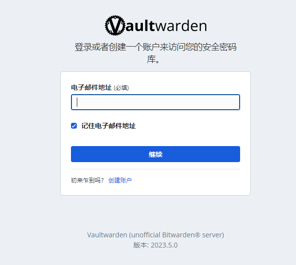

### 痛痛痛

生活在互联网上, 账号密码的记录真的是让人头疼的问题, 各种网站应用的登录,不同的账号密码规则,有时候还有同一个网站应用开了多套账号

因此,密码管理器顺势而出,只用记住一个主密码,就可以管理所有的账号密码

市面上的密码管理器有很多,非常有名的有1Password, LastPass, Dashlane, Bitwarden等等,V站上每个月都有讨论这方面的帖子

废话多说, 分享一下个人搭建的Bitwarden_RS使用体验


### Bitwarden_RS

一个docker-compose.yaml
```yaml
version: '3'
services:
  vaultwarden:
    image: vaultwarden/server:latest
    environment:
      - WEBSOCKET_ENABLED=true
      - SIGNUPS_ALLOWED=true
      - ENABLE_PASSWORD_HINTS=true
      - SHOW_PASSWORD_HINT=true
      - PASSWORD_HINTS_REQUIRED=false
    ports:
      - "13123:80"
      - "3012:3012"
    volumes:
      - ~/1ps/data:/data
    restart: always
```

SIGNUPS_ALLOWED=true 开启注册

ENABLE_PASSWORD_HINTS=true 开启密码提示

SHOW_PASSWORD_HINT=true 显示密码提示

服务器搭建完成在使用nginx反代, 加上域名, 套个https, 完美


**主页**

**注册**


**内容页**


应用/插件下载地址

https://bitwarden.com/download/


**Chrome插件**


**先写自建服务地址**


接下来在常用网站登录就会提示保存密码了

强烈开启密码填充

这样下次进来登录页面就会自动填充账号密码了,非常滴方便