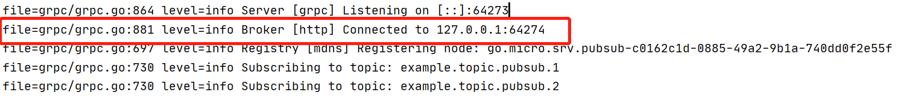
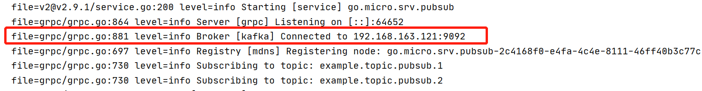

### 微服务框架 go-micro 使用 Kafka 作为发布订阅的 Broker 

go-micro 默认使用http服务作为服务中的Broker

服务默认启动的时候



使用kafka启动


http服务作为服务中的Broker，有三个明显的缺点：
1. 不能持久化存储
2. 不能对未消费的数据，进行消费
3. 每个需要发送消息的微服务都会启动一个 http Broker服务，可能会影响服务器性能

broker interface
```go
type Broker interface {
	Init(...Option) error
	Options() Options
	Address() string
	Connect() error
	Disconnect() error
	Publish(topic string, m *Message, opts ...PublishOption) error
	Subscribe(topic string, h Handler, opts ...SubscribeOption) (Subscriber, error)
	String() string
}
```


go-micro plugin也集成了 Kafka

接受端接受消息
```go
package main

import (
	"github.com/micro/go-micro/v2"
	"github.com/micro/go-micro/v2/metadata"
	"github.com/micro/go-micro/v2/util/log"
	proto "go14/micro/cmds/pubsub/push/proto"

	"context"
	"github.com/micro/go-micro/v2/broker"
	"github.com/micro/go-plugins/broker/kafka/v2"
)

// Sub 结构体所有能被暴露的方法都会执行消息处理的逻辑
type Sub struct{}


func (s *Sub) Process(ctx context.Context, event *proto.Event) error {
	md, _ := metadata.FromContext(ctx)
	log.Logf("[pubsub.1] Received event %+v with metadata %+v\n", event, md)
	// do something with event
	return nil
}

// func 形式也能处理对应的event
func subEv(ctx context.Context, event *proto.Event) error {
	md, _ := metadata.FromContext(ctx)
	log.Logf("[pubsub.2] Received event %+v with metadata %+v\n", event, md)
	// do something with event
	return nil
}

func main() {

	// 设置DefaultBroker为 kafka 的 Broker
	broker.DefaultBroker = kafka.NewBroker()
	// init kafka的地址
	if err := broker.Init(broker.Addrs("192.168.163.121:9092"),); err != nil {
		log.Fatalf("Broker Init error: %v", err)
	}

	// 创建service
	service := micro.NewService(
		micro.Name("go.micro.srv.pubsub"),
		micro.Broker(broker.DefaultBroker),
	)

	// 订阅消息
	if err := micro.RegisterSubscriber("example.topic.pubsub.1", service.Server(), new(Sub));err !=nil{
		log.Fatalf("RegisterSubscriber Init error: %v", err)
	}

	if err := micro.RegisterSubscriber("example.topic.pubsub.2", service.Server(), subEv);err !=nil{
		log.Fatalf("RegisterSubscriber Init error: %v", err)
	}

	if err := service.Run(); err != nil {
		log.Fatal(err)
	}
}

```

发送端发送消息
```go
package main

import (
	"fmt"
	"github.com/micro/go-micro/v2/client"
	"strconv"
	"time"

	"context"
	"github.com/micro/go-micro/v2"
	"github.com/micro/go-micro/v2/util/log"
	proto "go14/micro/cmds/pubsub/push/proto"

	"github.com/micro/go-micro/v2/broker"
	"github.com/micro/go-plugins/broker/kafka/v2"
)

// 发送消息
func sendEv(topic string, p micro.Publisher) {
	t := time.NewTicker(time.Second)

	for _ = range t.C {
		// 创建消息结构
		ev := &proto.Event{
			Id: strconv.FormatInt(time.Now().Unix(), 10),
			Timestamp: time.Now().Unix(),
			Message:   fmt.Sprintf("Messaging you all day on %s", topic),
		}
		log.Logf("publishing %+v\n", ev)
		// publish 消息
		if err := p.Publish(context.Background(), ev); err != nil {
			log.Logf("error publishing: %v", err)
		}
	}
}

func main() {
	// 设置DefaultBroker为 kafka 的 Broker
	broker.DefaultBroker = kafka.NewBroker()
	// init kafka的地址
	if err := broker.Init(broker.Addrs("192.168.163.121:9092"),); err != nil {
		log.Fatalf("Broker Init error: %v", err)
	}

	service := micro.NewService(
		micro.Name("go.micro.cli.pubsub"),
	)

	_ = service.Client().Init(client.Broker(broker.DefaultBroker))
	// create publisher
	pub1 := micro.NewEvent("example.topic.pubsub.1", service.Client())
	pub2 := micro.NewEvent("example.topic.pubsub.2", service.Client())

	// pub to topic 1
	go sendEv("example.topic.pubsub.1", pub1)
	// pub to topic 2
	go sendEv("example.topic.pubsub.2", pub2)

	select {}
}

```

pubsub.proto
```proto
syntax = "proto3";
package pubsub;
option go_package="/grpc";
// Example message
message Event {
  // unique id
  string id = 1;
  // unix timestamp
  int64 timestamp = 2;
  // message
  string message = 3;
}
```


