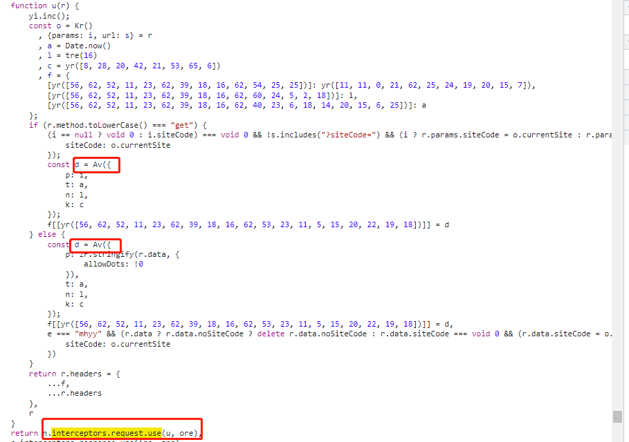

[//]: # (### <center> \[逆向学习小记之request headers藏了加密信息\] axios拦截器之axios.interceptors.request.use </center>)

网站
```javascript
btoa('aHR0cHM6Ly95Z3AuZ2R6d2Z3Lmdvdi5jbi8jLzQ0MDYwMC9qeWdn')
```

网站中所有请求都带了
```
X-Dgi-Req-App: xxxx
X-Dgi-Req-Nonce: xxx
X-Dgi-Req-Signature: xxxxxxx
X-Dgi-Req-Timestamp: xxx

```

错误的签名或者没有签名都会出现错误

```json
{
    "errcode": 91000,
    "errmsg": "参数签名异常"
}
```

看看网站js源码,使用 axios 发起响应请求 

发送请求前都会设置 header 添加加密信息, 在Source里搜一下 interceptors.request.use

得到了 




`function u(r)` 就是设置 header 添加加密参数的方法

基本上追一下就能拿取到想用的东西了