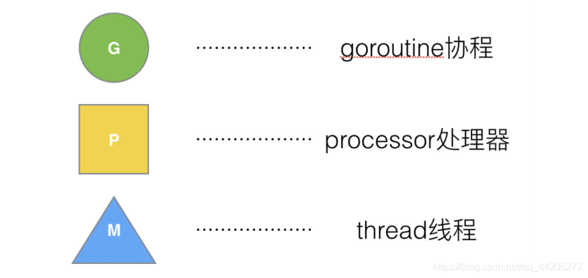

Go 语言的协程 goroutine
Go 为了提供更容易使用的并发方法，使用了 goroutine 和 channel。goroutine 来自协程的概念，让一组可复用的函数运行在一组线程之上，即使有协程阻塞，该线程的其他协程也可以被 runtime 调度，转移到其他可运行的线程上。最关键的是，程序员看不到这些底层的细节，这就降低了编程的难度，提供了更容易的并发。

Go 中，协程被称为 goroutine，它非常轻量，一个 goroutine 只占几 KB，并且这几 KB 就足够 goroutine 运行完，这就能在有限的内存空间内支持大量 goroutine，支持了更多的并发。虽然一个 goroutine 的栈只占几 KB，但实际是可伸缩的，如果需要更多内容，runtime 会自动为 goroutine 分配。

Goroutine 特点：

占用内存更小（几 kb）
调度更灵活 (runtime 调度)

goroutine 基于GMP调度模型完成

### 设计原理 

#### 单线程调度器 0.x
调度器只包含表示 Goroutine 的 G 和表示线程的 M 两种结构，全局也只有一个线程

#### 多线程调度器 1.0
多线程调度器引入了 GOMAXPROCS 变量帮助我们灵活控制程序中的最大处理器数，即活跃线程数

#### 任务窃取调度器 1.1

在多线程调度器上进行改进
  - 在当前的 G-M 模型中引入了处理器 P，增加中间层
  - 在处理器 P 的基础上实现基于工作窃取的调度器

##### work-stealing
当前处理器本地的运行队列中不包含 Goroutine 时，调用会触发工作窃取，从其它的处理器的队列中随机获取一些 Goroutine

处理器持有一个由可运行的 Goroutine 组成的环形的运行队列 runq，还反向持有一个线程。调度器在调度时会从处理器的队列中选择队列头的 Goroutine 放到线程 M 上执行

基于工作窃取的多线程调度器将每一个线程绑定到了独立的 CPU 上，这些线程会被不同处理器管理，不同的处理器通过工作窃取对任务进行再分配实现任务的平衡，也能提升调度器和 Go 语言程序的整体性能，今天所有的 Go 语言服务都受益于这一改动

#### 抢占式调度器 · 1.2 ~ 至今
  - 基于协作的抢占式调度器 - 1.2 ~ 1.13
    - 通过编译器在函数调用时插入抢占检查指令，在函数调用时检查当前 Goroutine 是否发起了抢占请求，实现基于协作的抢占式调度；
    - Goroutine 可能会因为垃圾回收和循环长时间占用资源导致程序暂停；
  - 基于信号的抢占式调度器 - 1.14 ~ 至今
    - 实现**基于信号的真抢占式调度**；
    - 垃圾回收在扫描栈时会触发抢占调度；
    - 抢占的时间点不够多，还不能覆盖全部的边缘情况；

对 Go 语言并发模型的修改提升了调度器的性能，但是 1.1 版本中的调度器仍然不支持抢占式调度，程序只能依靠 Goroutine 主动让出 CPU 资源才能触发调度

##### 基于协作的抢占式调度器
Go 语言的调度器在 1.2 版本中引入基于协作的抢占式调度解决下面的问题：

  - 某些 Goroutine 可以长时间占用线程，造成其它 Goroutine 的饥饿
  - 垃圾回收需要暂停整个程序（Stop-the-world，STW），最长可能需要几分钟的时间，导致整个程序无法工作

1.2 版本的抢占式调度虽然能够缓解这个问题，但是它实现的抢占式调度是基于协作的，在之后很长的一段时间里 Go 语言的调度器都有一些无法被抢占的边缘情况，例如：for 循环或者垃圾回收长时间占用线程，这些问题中的一部分直到 1.14 才被基于信号的抢占式调度解决

##### 基于信号的抢占式调度器
Go 语言在 1.14 版本中实现了非协作的抢占式调度，在实现的过程中我们重构已有的逻辑并为 Goroutine 增加新的状态和字段来支持抢占。Go 团队通过下面的一系列提交实现了这一功能，我们可以按时间顺序分析相关提交理解它的工作原理

##  调度器的 GMP 模型

Processor，它包含了运行 goroutine 的资源，如果线程想运行 goroutine，必须先获取 P，P 中还包含了可运行的 G 队列