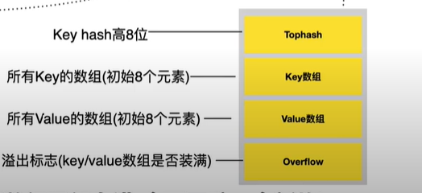

参考 ： 

https://draveness.me/golang/docs/part2-foundation/ch03-datastructure/golang-hashmap/

https://www.bilibili.com/video/BV1Sp4y1U7dJ


map是一堆键值对的未排序集合

hashmap 会存在哈希冲突

解决 hash 冲突办法：

  - 开放寻址法
    - 线性探测法：向后依次探测可以存放的位置, 直到找到为止（最坏情况下时间复杂度O(n)）
    - 二次线性探测：当前key存在该地址后偏移量为（1,2,3...）的二次方地址处
    - 双重散列：对hash值使用多组散列函数重新计算位置, 直到找到空闲位置为止
  - 拉链法: 每个位置对应一个链表, 查找key所在的链表, 然后在链表顺序查找位置

golang map使用改进的拉链法解决冲突

map的底层是通过hmap（hashmap）来实现的

map底层数据结构

```golang

type hmap struct {
	count     int //表示当前哈希表中的元素数量；
	flags     uint8
	B         uint8 //表示当前哈希表持有的 buckets 数量, 但是因为哈希表中桶的数量都 2 的倍数, 所以该字段会存储对数, 也就是 len(buckets) == 2^B；
	noverflow uint16
	hash0     uint32 //是哈希的种子, 它能为哈希函数的结果引入随机性, 这个值在创建哈希表时确定, 并在调用哈希函数时作为参数传入；

	buckets    unsafe.Pointer 
	oldbuckets unsafe.Pointer // 哈希在扩容时用于保存之前 buckets 
	nevacuate  uintptr // 渐进式扩容下一个需要迁移的旧桶的编号

	extra *mapextra  //记录的是溢出桶的相关信息
}

type mapextra struct {
	overflow    *[]*bmap
	oldoverflow *[]*bmap
	nextOverflow *bmap
}

type bmap struct {
    topbits  [8]uint8
    keys     [8]keytype
    values   [8]valuetype
    pad      uintptr
    overflow uintptr // 指向溢出的桶
}

```

hmap


bmap


如果哈希表要分配的桶的数目大于2^4, 就认为会使用到溢出桶的几率比较大, 就会预分配2^(B-4)个溢出桶, 溢出桶和常规桶在内存中是连续的

map 扩容的负载因子是6.5

```Load factor = count/(2^B)```

负载因子超过6.5会触发**翻倍扩容**
 
如果负载因子没有超标, 使用的溢出桶过多, 触发**等量扩容**

```
B <= 15, noverflow(溢出桶) >= 2^B
B > 15, noverflow(溢出桶) >= 2^15
```

为什么要等量扩容, 因为负载因子过低, 也就是count太低, 表示大量进行了删除操作, 等量扩容可以使正常桶和溢出桶中的元素可以合并, 从而减少溢出桶的使用
 