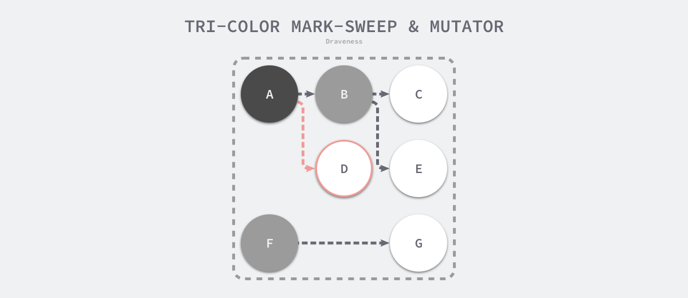
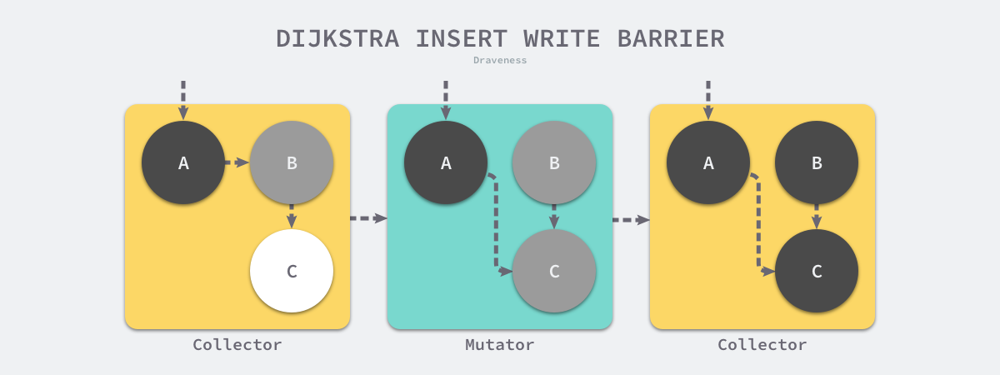
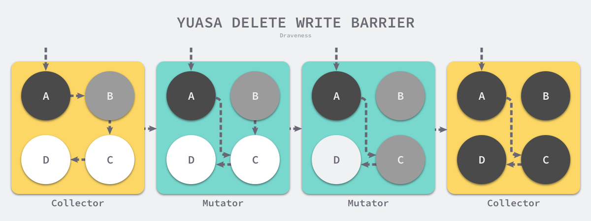

## 堆内存

arena(64MB) -> 8192 page(8KB)


span -> N page(一个span包含多个page)-> M 内存块(一个span等分M个内存块)

Go 语言的内存管理模块中一共包含 67 种跨度类
spanclass1 - 8B 
...
spanclass67 - 32KB 

spanclass 0 表示大于32KB的大块内存


- 微对象 (0, 16B) — 先使用微型分配器，再依次尝试线程缓存、中心缓存和堆分配内存；
- 小对象 [16B, 32KB] — 依次尝试使用线程缓存、中心缓存和堆分配内存；
- 大对象 (32KB, +∞) — 直接在堆上分配内存


### 堆栈内存

程序中的数据和变量都会被分配到程序所在的虚拟内存中, 内存空间包含两个重要区域：栈区（Stack）和堆区（Heap）。

栈的存取速度比堆要快, 但是缺乏灵活性, 栈中数据大小和生命周期是确定的定的, 函数调用的参数、返回值以及局部变量大都会被分配到栈上, 这部分内存会由编译器进行管理

不同编程语言使用不同的方法管理堆区的内存, C++ 等编程语言会由工程师主动申请和释放内存, Go 以及 Java 等编程语言会由工程师和编译器共同管理, 堆中的对象由内存分配器分配并由垃圾收集器回收, 缺点是内存分配管理会占用资源, 速度慢, 而且会出现内存碎片和（堆）内存溢出

堆上所有的对象都会通过调用 runtime.newobject 函数分配内存, 该函数会调用


### 逃逸分析

在编译器优化中, 逃逸分析是用来决定指针动态作用域的方法。Go 语言的编译器使用逃逸分析决定哪些变量应该在栈上分配, 哪些变量应该在堆上分配, 其中包括使用 new、make 和字面量等方法隐式分配的内存, Go 语言的逃逸分析遵循以下两个不变性：

- 指向栈对象的指针不能存在于堆中；
- 指向栈对象的指针不能在栈对象回收后存活；

变量是否会被函数外部引用决定了堆栈内存的分配, 如果外部没有引用, 那么对象优先创建在栈内存, 如果外部确定了引用, 那么对象必定会创建在堆内存, 编译器并不能确定是否会被外部引用, 那么也会创建在堆内存中 

```shell
go build -gcflags "-m -l" common.go
go tool compile -S common.go
```

### 垃圾回收

# STW
随着用户程序申请越来越多的内存, 系统中的垃圾也逐渐增多；当程序的内存占用达到一定阈值时, 整个应用程序就会全部暂停, 垃圾收集器会扫描已经分配的所有对象并回收不再使用的内存空间, 当这个过程结束后, 用户程序才可以继续执行, 出现了暂停程序（Stop the world, STW）问题

#### 标记清除 

标记清除（Mark-Sweep）算法是最常见的垃圾收集算法, 标记清除收集器是跟踪式垃圾收集器, 其执行过程可以分成标记（Mark）和清除（Sweep）两个阶段：
- 标记阶段 — 从根对象出发查找并标记堆中所有存活的对象；
- 清除阶段 — 遍历堆中的全部对象, 回收未被标记的垃圾对象并将回收的内存加入空闲链表


### 三色抽象 
为了解决原始标记清除算法带来的长时间STW, 多数现代的追踪式垃圾收集器都会实现三色标记算法的变种以缩短 STW 的时间。三色标记算法将程序中的对象分成白色、黑色和灰色三类4：

- 白色对象 — 潜在的垃圾, 其内存可能会被垃圾收集器回收；
- 黑色对象 — 活跃的对象, 包括不存在任何引用外部指针的对象以及从根对象可达的对象；
- 灰色对象 — 活跃的对象, 因为存在指向白色对象的外部指针, 垃圾收集器会扫描这些对象的子对象；


在垃圾收集器开始工作时, 程序中不存在任何的黑色对象, 垃圾收集的根对象会被标记成灰色, 垃圾收集器只会从灰色对象集合中取出对象开始扫描, 当灰色集合中不存在任何对象时, 标记阶段就会结束


三色标记垃圾收集器的工作原理很简单, 归纳成以下几个步骤：

- 从灰色对象的集合中选择一个灰色对象并将其标记成黑色；
- 将黑色对象指向的所有对象都标记成灰色, 保证该对象和被该对象引用的对象都不会被回收；
- 重复上述两个步骤直到对象图中不存在灰色对象；


因为用户程序可能在标记执行的过程中修改对象的指针, 所以三色标记清除算法本身是不可以并发或者增量执行的, 它仍然需要 STW, 在如下所示的三色标记过程中, 用户程序建立了从 A 对象到 D 对象的引用, 但是因为程序中已经不存在灰色对象了, 所以 D 对象会被垃圾收集器错误地回收


本来不应该被回收的对象却被回收了, 这在内存管理中是非常严重的错误, 我们将这种错误称为悬挂指针, 即指针没有指向特定类型的合法对象, 影响了内存的安全性, 想要并发或者增量地标记对象还是需要使用屏障技术

### 屏障技术

内存屏障技术是一种屏障指令, 它可以让 CPU 或者编译器在执行内存相关操作时遵循特定的约束, 目前多数的现代处理器都会乱序执行指令以最大化性能, 但是该技术能够保证内存操作的顺序性, 在内存屏障前执行的操作一定会先于内存屏障后执行的操作

想要在并发或者增量的标记算法中保证正确性, 我们需要达成以下两种三色不变性（Tri-color invariant）中的一种：

- 强三色不变性 — 黑色对象不会指向白色对象, 只会指向灰色对象或者黑色对象；
- 弱三色不变性 — 黑色对象指向的白色对象必须包含一条从灰色对象经由多个白色对象的可达路径

#### 插入写屏障



插入写屏障, 在一个垃圾收集器和用户程序交替运行的场景中会出现如上图所示的标记过程：

- 垃圾收集器将根对象指向 A 对象标记成黑色并将 A 对象指向的对象 B 标记成灰色；
- 用户程序修改 A 对象的指针, 将原本指向 B 对象的指针指向 C 对象, 这时触发写屏障将 C 对象标记成灰色；
- 垃圾收集器依次遍历程序中的其他灰色对象, 将它们分别标记成黑色

插入写屏障是一种相对保守的屏障技术, 它会将有存活可能的对象都标记成灰色以满足强三色不变性。在如上所示的垃圾收集过程中, 实际上不再存活的 B 对象最后没有被回收；而如果我们在第二和第三步之间将指向 C 对象的指针改回指向 B, 垃圾收集器仍然认为 C 对象是存活的, 这些被错误标记的垃圾对象只有在下一个循环才会被回收。

```go
writePointer(slot, ptr)
    shade(*slot)
    *slot = ptr
```

插入式写屏障虽然实现非常简单并且也能保证强三色不变性, 但是它也有明显的缺点。因为栈上的对象在垃圾收集中也会被认为是根对象, 所以为了保证内存的安全, Dijkstra 必须为栈上的对象增加写屏障或者在标记阶段完成重新对栈上的对象进行扫描, 这两种方法各有各的缺点, 前者会大幅度增加写入指针的额外开销, 后者重新扫描栈对象时需要暂停程序, 垃圾收集算法的设计者需要在这两者之前做出权衡


#### 删除写屏障




假设我们在应用程序中使用 Yuasa 提出的删除写屏障, 在一个垃圾收集器和用户程序交替运行的场景中会出现如上图所示的标记过程：

垃圾收集器将根对象指向 A 对象标记成黑色并将 A 对象指向的对象 B 标记成灰色；
- 用户程序将 A 对象原本指向 B 的指针指向 C, 触发删除写屏障, 但是因为 B 对象已经是灰色的, 所以不做改变；
- 用户程序将 B 对象原本指向 C 的指针删除, 触发删除写屏障, 白色的 C 对象被涂成灰色；
- 垃圾收集器依次遍历程序中的其他灰色对象, 将它们分别标记成黑色


因为增量和并发两种方式都可以与用户程序交替运行, 所以我们需要使用屏障技术保证垃圾收集的正确性；与此同时, 应用程序也不能等到内存溢出时触发垃圾收集, 因为当内存不足时, 应用程序已经无法分配内存, 这与直接暂停程序没有什么区别, 增量和并发的垃圾收集需要提前触发并在内存不足前完成整个循环, 避免程序的长时间暂停

#### 混合写屏障

在 Go 语言 v1.7 版本之前, 运行时会使用 Dijkstra 插入写屏障保证强三色不变性, 但是运行时并没有在所有的垃圾收集根对象上开启插入写屏障。因为应用程序可能包含成百上千的 Goroutine, 而垃圾收集的根对象一般包括全局变量和栈对象, 如果运行时需要在几百个 Goroutine 的栈上都开启写屏障, 会带来巨大的额外开销, 所以 Go 团队在实现上选择了在标记阶段完成时暂停程序、将所有栈对象标记为灰色并重新扫描, 在活跃 Goroutine 非常多的程序中, 重新扫描的过程需要占用 10 ~ 100ms 的时间。

Go 语言在 v1.8 组合 Dijkstra 插入写屏障和 Yuasa 删除写屏障构成了如下所示的混合写屏障, 该写屏障会将被覆盖的对象标记成灰色并在当前栈没有扫描时将新对象也标记成灰色

```go
writePointer(slot, ptr):
    shade(*slot)
    if current stack is grey:
        shade(ptr)
    *slot = ptr
```


为了移除栈的重扫描过程, 除了引入混合写屏障之外, 在垃圾收集的标记阶段, 我们还需要将创建的所有新对象都标记成黑色, 防止新分配的栈内存和堆内存中的对象被错误地回收, 因为栈内存在标记阶段最终都会变为黑色, 所以不再需要重新扫描栈空间


### gc触发时机

- 内存分配量达到阈值:— 堆内存的分配达到达控制器计算的触发堆大小；
- 定时触发：— 如果一定时间内没有触发, 就会触发新的循环, 该出发条件由 runtime.forcegcperiod 变量控制, 默认为 2 分钟；
- 手动触发：**runtime.GC** 用户程序手动触发垃圾收集


#### Go GC如何工作
Golang GC的大部分处理是和用户代码并行的, GC期间用户代码可能会改变某些对象的状态, 如何实现并行呢？
1. Mark：
Mark Prepare：初始化GC任务, 包括开启写屏障（write barrier）和辅助GC（mutator assist）, 统计root对象的任务数量等, 这个过程需要STW。
GC Drains：扫描所有root对象, 包括全局指针和goroutine（G）栈上的指针, 扫描对于G栈时需停止该G, 将其加入标记队列（灰色队列）, 并循环处理灰色队列的对象, 直到灰色对象为空, 该过程后台并行执行。
2. Mark Termination：完成标记工作, 需要重新扫描全局指针和栈, 因为Mark和用户程序是并行的, 所以在该过程中可能会有新的对象分配和指针赋值, 这个时候就需要通过写屏障记录下来, 重新扫描再检查一下。这个过程也是会STW的。
3. Sweep：按照标记结果回收所有的白色对象, 该过程后台并行执行。
4. Sweep Termination：对未扫描的范围进行扫描, 只有上一轮GC的清扫工作完成才可以开始新的一轮GC。

#### 辅助GC

Golang实际是把用户代码-->大段GC--->用户代码分散为用户代码--->小段GC--->用户代码--->小段GC--->用户代码, 如果GC速度跟不上分配速度, 会把用户逻辑暂停, 同时会把用户线程抢占过来加入到垃圾回收里面加快垃圾回收速度。