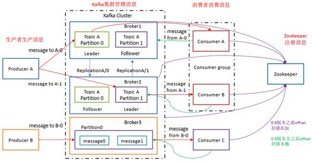

### Kafka特点：

    1 解耦合 消息队列提供了借口，生产者和消费者能够独立的完成读操作和写操作。

    2 高吞吐率。即使是在廉价的商用机器上也能做到单机支持每秒100K条消息的传输

    3 信息传输快。以时间复杂度为O（1）的方式提供持久化能力，即使对TB级以上数据也能保证常数时间的访问性能

    4 可提供持久化。消息存储在中间件上，数据持久化，直到全部被处理完，通过这一方式规避了数据丢失的风险


### Kafka适用场景

    根据上述功能和特点，Kafka主要有以下使用场景：

    信息系统 Messaging 。 在这个领域中，Kafka常常被拿来与传统的消息中间件进行对比，如RabbitMQ。

    网站活动追踪 Website Activity Tracking

    监控 Metrics

    日志收集 Log Aggregation

    流处理 Stream Processing

    事件溯源 Event Sourcing

    提交日志 Commit Log
    
    

### Kafka架构图

    Producer ： 消息生产者，就是向 Kafka发送数据 ；

    Consumer ： 消息消费者，从 Kafka broker 取消息的客户端；

    Consumer Group （CG）： 消费者组，由多个 consumer 组成。 消费者组内每个消费者负责消费不同分区的数据，一个分区只能由一个组内消费者消费；消费者组之间互不影响。 所有的消费者都属于某个消费者组，即消费者组是逻辑上的一个订阅者。

    Broker ：经纪人 一台 Kafka 服务器就是一个 broker。一个集群由多个 broker 组成。一个 broker可以容纳多个 topic。

    Topic ： 话题，可以理解为一个队列， 生产者和消费者面向的都是一个 topic；

    Partition： 为了实现扩展性，一个非常大的 topic 可以分布到多个 broker（即服务器）上，一个 topic 可以分为多个 partition，每个 partition 是一个有序的队列；如果一个topic中的partition有5个，那么topic的并发度为5.

    Replica： 副本（Replication），为保证集群中的某个节点发生故障时， 该节点上的 partition 数据不丢失，且 Kafka仍然能够继续工作， Kafka 提供了副本机制，一个 topic 的每个分区都有若干个副本，一个 leader 和若干个 follower。

    Leader： 每个分区多个副本的“主”，生产者发送数据的对象，以及消费者消费数据的对象都是 leader。

    Follower： 每个分区多个副本中的“从”，实时从 leader 中同步数据，保持和 leader 数据的同步。 leader 发生故障时，某个 Follower 会成为新的 leader。

    Offset ： 每个Consumer 消费的信息都会有自己的序号，我们称作当前队列的offset。即消费点位标识消费到的位置。每个消费组都会维护订阅的Topic 下每个队列的offset

### 安装

阿里云镜像地址: http://mirrors.aliyun.com/apache/kafka/

下载 kafka_2.13-3.2.1.tgz

```

# 解压
tar zxvf kafka_2.13-3.2.1.tgz -C /opt/module

# 运行
cd /opt/module

# 启动zookeeper
./bin/zookeeper-server-start.sh  config/zookeeper.properties

# 后台启动
./bin/zookeeper-server-start.sh -daemon config/zookeeper.properties 

# 启动kafka
./bin/kafka-server-start.sh config/server.properties

# 后台启动
./bin/kafka-server-start.sh -daemon config/server.properties


```

