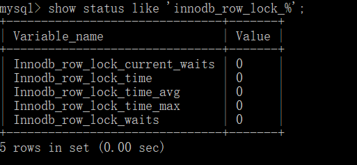

### 行锁

InnoDB 的行锁模式她丝旦实现了以下两种类型的行锁

   共享锁（ S ) ：又称为读锁, 简称 S 锁, 共享锁就是多个事务对于同一数据可以共享一把锁, 都能访问到数据, 但是只能读不能修改
   
   排他锁（ X ) ：又称为写锁, 简称 X 锁, 排他锁就是不能与其他锁并存, 如一个事务获取了一个数据行的排他锁, 其他事务就不能再获取该行的其他锁, 包括共享锁和排他锁, 但是获取排他锁的事务是可以就行读取和修改

对于 UPDATE 、DELETE 和 INSERT 语句, InnoDB会自动给涉及数据加排他锁（ x ) ; 

对于普通 SELECT 语句, InnoDB 不会加任何锁, 


显示添加锁
```sql
LOCK IN SHARE MODE; # 共享锁 S

FOR UPDATE; # 排他锁 X


```

### 行锁升级为表锁


WHERE 条件后面没有使用索引, 或者索引失效, 行锁会升级为表锁


### 间隙锁

当使用范围条件时, 而不是使用相等条件检索数据, 并请求共享或排它锁时, InnoDB会给符合条件的已有数据加锁, 对于键值在条件范围内但不存在的记录, 叫做 "间隙(GAP)", InnoDB 也会对这个 "间隙" 加锁, 这种锁机制叫间隙锁(Next-Key锁)


### 行锁争用情况查看

    show status like 'innodb_row_lock_%';   




Innodb_row_lock_current_waits:当前正在等待锁定的数量
Innodb_row_lock_time:从系统启动到现在锁定总时间长度
Innodb_row_lock_time_avg: 每次等待所花平均时长
Innodb_row_lock_time_max:从系统启动到现在等待最长的一次时间
Innodb_row_lock_waits:系统启动到现在总共等待次数


总结：
 尽量使用索引来检索数据, 避免行锁升级为表锁
 合理设计索引, 尽量减少锁的使用范围
 尽可能减少索引条件, 以及索引范围, 避免间隙锁
 尽量控制事务大小, 减少锁定资源量和时间长度
 尽可能使用低级别的事务隔离
 