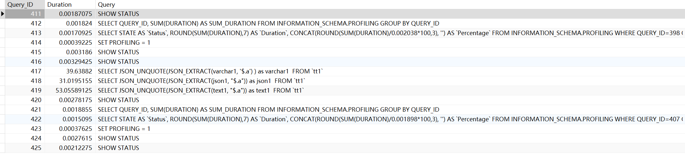
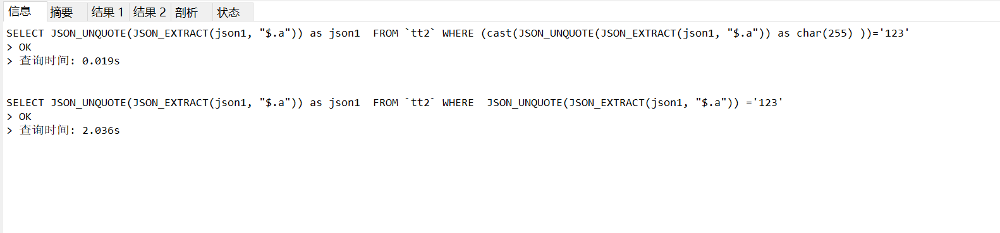

JSON数据在不同字段的处理方式：


|         |大小|字符集 | 校验| 索引 | 备注 |
|--------|------|--------|--------|-------|------|
| varchar(N)  | N  | 表的字符集 |长度限制,字符集,排序规则 | 普通索引，唯一索引  |表总和不能超过65535个字符(除去text,JSON, blob类型)|
| text     | 65535个字符 | 表的字符集 | 长度限制,字符集,排序规则 | 普通索引,全文索引 |  |
| JSON     | 64MB(默认, 可修改) | utf8mb4  | 大小,字符集的校验,深度限制(100层),JSON格式校验 | 利用虚拟列提取JSON字段作为索引,多值索引(类似普通索引)  |   |

！！！注意NULL和JSON的null值不同，NULL表示字段值为空，JSON的null值表示字段值是一个空对象

### 基础：

1. 插入
```sql
    INSERT INTO `tt1` (`id`, `varchar1`, `JSON1`, `text1`) VALUES (1, '{\"a\":\"GXjc0C4hOU\",\"b\":5262145246}', '{\"a\": \"GXjc0C4hOU\", \"b\": 5262145246}', '{\"a\":\"GXjc0C4hOU\",\"b\":5262145246}');
```
可以理解为插入的数据实际上是JSON字符串，在插入时会自动解析为JSON对象，然后存储到JSON字段中。


2. 修改

```sql
    # 直接修改JSON字段
    UPDATE `tt1` SET `JSON1` = '{\"a\": \"GXjc0C4hOU\", \"b\": 5262145246}' WHERE `id` = 1;
    # 直接修改JSON字段的某个值
    UPDATE `tt1` SET `JSON1` = JSON_SET(JSON1, '$.b', 31) WHERE `id` = 1;
    # 直接修改JSON数组
    UPDATE `tt1` SET `JSON_arr` = JSON_SET(JSON_arr, '$[0]', "3") WHERE `id` = 1;
    # 嵌套修改
    UPDATE `tt1` SET `text1` = JSON_SET(text1, '$.c.d', 31) WHERE `id` = 1;
```

3. 查询(！！！使用JSON函数作为查询条件会走全表扫描)

```sql
    SELECT JSON_UNQUOTE(JSON_EXTRACT(JSON1, "$.a")) as JSON1  FROM `tt1` WHERE JSON_UNQUOTE(JSON_EXTRACT(JSON1, "$.a")) = '123' ;
```


### 常用JSON函数：

    - JSON_EXTRACT(json_column, path)：从json_column中提取path指定的JSON对象，返回JSON对象。
    - JSON_UNQUOTE(json_column)：将json_column中的所有字符串类型的值都转换为普通字符串。
    - JSON_VALUE(json_column, path)：从json_column中提取path指定的JSON对象的值，返回JSON对象的值。
    - JSON_SET(json_column, path, value)：在json_column中设置path指定的JSON对象的值为value，返回修改后的json_column。
    - JSON_REMOVE(json_column, path)：在json_column中删除path指定的JSON对象，返回修改后的json_column。
    - JSON_MERGE_PRESERVE(json_column1, json_column2)：将json_column2合并到json_column1中，如果json_column1中有相同的key，则覆盖json_column1中的值。
    - JSON_MERGE_PATCH(json_column1, json_column2)：将json_column2合并到json_column1中，如果json_column1中有相同的key，则保留json_column1中的值。
    - JSON_QUERY(json_column, path)：从json_column中提取path指定的JSON对象，返回JSON对象。
    - JSON_LENGTH(json_column)：返回json_column的长度。
    - JSON_TYPE(json_column)：返回json_column的类型。
    - JSON_VALID(json_column)：判断json_column是否是一个有效的JSON字符串。
    - JSON_ARRAY_LENGTH(json_column)：返回json_column的数组长度。
    - JSON_OVERLAPS(json_column1, json_column2)：判断json_column1和json_column2是否有交集。、
    - JSON_CONTAINS(json_column1, json_column2)：判断json_column1是否包含json_column2。


### 性能：

    测试环境： 1000W条数据
    CREATE TABLE `tt1` (
    `id` int NOT NULL AUTO_INCREMENT,
    `varchar1` varchar(2047) CHARACTER SET utf8mb4 COLLATE utf8mb4_0900_as_cs DEFAULT NULL,
    `JSON1` JSON DEFAULT NULL,
    `text1` text CHARACTER SET utf8mb4 COLLATE utf8mb4_0900_as_cs,
    `JSON_arr` JSON DEFAULT NULL,
    PRIMARY KEY (`id`)
    ) ENGINE=InnoDB  DEFAULT CHARSET=utf8mb4 COLLATE=utf8mb4_0900_as_cs;

    
    SET profiling = 1;


    SELECT JSON_UNQUOTE(JSON_EXTRACT(varchar1, '$.a') ) as varchar1  FROM `tt1` ;
    SELECT JSON_UNQUOTE(JSON_EXTRACT(JSON1, "$.a")) as JSON1  FROM `tt1` ;
    SELECT JSON_UNQUOTE(JSON_EXTRACT(text1, "$.a")) as text1  FROM `tt1` ;


    SHOW PROFILES;



JSON耗时比其他类型少, MYSQL对JSON字段有单独优化,因为在插入得时候已经解析为JSON对象了,其他类型需要额外转换


### JSON-索引

JSON字段创建索引
```sql
alter table tt1 add index idx_ttt_JSON1_a( (cast(JSON_UNQUOTE(JSON_EXTRACT(JSON1, "$.a")) as char(255) )) );
```

使用索引查询
```sql
SELECT JSON_UNQUOTE(JSON_EXTRACT(JSON1, "$.a")) as JSON1  FROM `tt2` WHERE (cast(JSON_UNQUOTE(JSON_EXTRACT(JSON1, "$.a")) as char(255) ))='123';
```

效果：



数组形式
```sql
alter table tt1 add index idx_ttt_JSON1_a( (cast(JSON_UNQUOTE(JSON_EXTRACT(JSON1, "$.a")) as char(255) ARRAY )) );
```

查询，提供了三个查询函数

MEMBER OF() 数组中是否存在某一值（如果是唯一匹配查询建议用这种否则选下面两种）

JSON_CONTAINS() 数组中是否包含某些值，交集(必须都包含，此处注意mysql版本必须是8.024以上否则使用可能会失效)

JSON_OVERLAPS() 数组中是否包含某些值，并集(只要包含一个就行省的用JSON_CONTAINS一直OR)

### 优缺点

优点：
1. 灵活的数据结构：JSON字段可以存储复杂的数据结构，如数组、对象、字符串等。
2. 存储空间：JSON字段的存储空间比其他类型更大。
3. 提供了JSON的校验功能：JSON字段可以对数据结构进行校验，确保数据符合要求。


缺点：
1. 性能：JSON字段的性能比其他类型更差,尤其是在查询时。
2. 结构可能会混乱,如字符串和数字可以混合,需要插入的人保证结构一致性。如：row1.JSON_field = {"a": "123"} row2.JSON_field = {"a": 456}
3. 数据更新不方便：JSON字段的更新比较麻烦,需要先解析JSON,然后再更新。(如之前发生的手机号转换,zipcode转换地址等)


### 使用建议??

作为一些不必要查询，修改的复杂数据结构，使用JSON，可以存储更多的内容,也可以避免使用新的关联表来存储数据,减少数据库的耦合性,提高开发效率

但是一涉及到数据的查询和修改，都需要注意JSON的性能问题, 没有索引使用JSON相关的处理函数会导致全表扫描数据,导致性能下降,而使用了JSON相关的索引,则需要维护数据的的结构和类型，避免出现数据类型不一致的情况