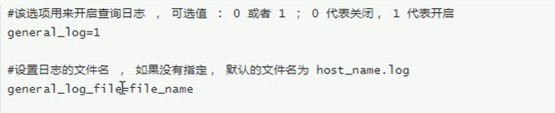
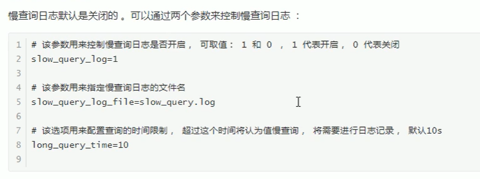

### 错误日志

记录服务器启动, 运行相关发生的严重的错误信息

    show variables like "log_error%"；


### binlog


记录了所有DDL(数据定义语言)语句和DML(数据操作语言)语句, 但是不包括查询语句, 对容灾恢复, 主从复制有作用


默认不开启

需要在my.conf中配置
    
    # 日志前缀 mysqlbin.00001 mysqlbin.00002
    log_bin=mysqlbin
    bin_log_format=STATMENT

#### 日志格式

##### STATMENT

记录的都是SQL(不包括查询)语句 通过 mysqlbinlog 工具可以解析出SQL语句


##### ROW

记录的都是每一行数据的变更而不是SQL语句

##### MIXED
Mysql 默认的日志格式
集成了STATMENT, ROW, 默认情况下采用STATMENT,  特殊情况下采用ROW
尽量利用他们的有点, 避免其缺点


mysqlbinlog 工具可以查看二进制日志文件

STATMENT格式下就可以查看的执行的SQL语句

    mysqlbinlog log-file

ROW格式下就可以查看的执行的SQL变更情况

    mysqlbinlog -vv log-file


#### 清除日志

1. 删除全部binlog日志, 日志编号从xxx.000001开始

    mysql> Reset Master

2. ```mysql> purge master logs to "xxxx.00000x"``` 删除日志00000x之前的所有日志

3. ```mysql> purge master logs before "yyyy-mm-dd hh24:mi:ss"``` 删除日志yyyy-mm-dd hh24:mi:ss之前的所有日志

4. --expire_logs_days=xx,日志过期时间 在my.conf配置


### 查询日志

明文显示数据库查询日志



### 慢查询日志

慢查询日志记录所有执行时间超过参数 long_query_time 设置值, 并且扫描记录不小于min_examined_wor_limit的所有的SQL语句的日志

long_query_time 默认是10s, 可以精确到微秒

