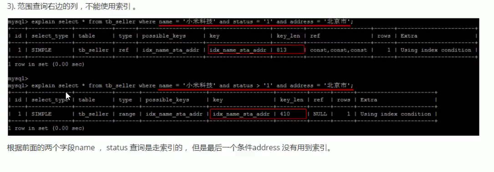
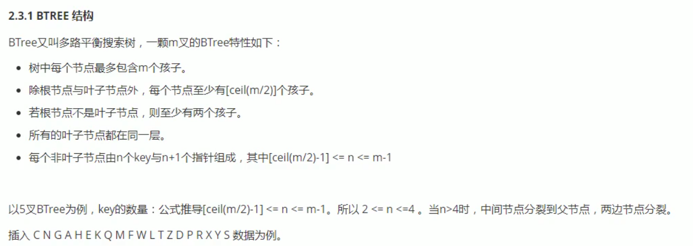

####  聚簇索引与非聚簇索引b+树实现有什么区别

分为聚簇索引和非聚簇索引（有时也称辅助索引或二级索引）

聚簇是为了提高某个属性(或属性组)的查询速度, 把这个或这些属性(称为聚簇码)上具有相同值的元组集中存放在连续的物理块。

聚簇索引（clustered index）不是单独的一种索引类型, 而是一种数据存储方式。这种存储方式是依靠B+树来实现的, 根据表的主键构造一棵B+树且B+树叶子节点存放的都是表的行记录数据时, 方可称该主键索引为聚簇索引
。聚簇索引也可理解为将数据存储与索引放到了一块, 找到索引也就找到了数据。

非聚簇索引：数据和索引是分开的, B+树叶子节点存放的不是数据表的行记录

虽然InnoDB和MyISAM存储引擎都默认使用B+树结构存储索引, 但是只有InnoDB的主键索引才是聚簇索引,  InnoDB中的辅助索引以及MyISAM使用的都是非聚簇索引。每张表最多只能拥有一个聚簇索引。

#### 逻辑分类
key：等价普通索引 key 键名 (列)

主键索引primary key：

+ 约束作用（constraint）, 主键约束（unique, not null, 一表一主键, 唯一标识记录）, 规范存储主键和强调唯一性
为这个key建立主键索引

单值(普通)索引：一个索引只包含单个列, 一个表可以有多个单列索引

唯一索引：索引列的值必须唯一, 但允许有空值

复合索引：一个索引可以包含多个列

全文索引

最左前缀法则(联合索引)
指的是, 查询从索引的最左前列开始, 不得跳过索引中的列

和 where 后面的先后条件没有关系

    1,2,3
    where 1=xxx and 2=xxx, 3=xxx, 只走1, 2, 3 的索引
    where 1=xxx and 3=xxx,  只走1, 的索引
    where 1=xxx and 2=xxx   只走1, 2的索引
    where 1=xxx             只走1, 的索引
    where 2=xxx and 3 =xxx  只走2, 3 的索引
    where 2=xxx             只走2, 的索引
    where 3=xxx             只走3, 的索引
  

索引失效的情况

1. 范围查询右边的列, 不使用索引

2. 不能在索引列上进行运算操作

    例如 where substring(name, 3, 2) = "xxx" 即使创建了name的索引, 索引也会失效

3. 字符串不加引号, 也会导致索引失效
    where name = 1

4. 尽量避开select(*), 尽量使用覆盖索引, 避免不必要的回表查询

5. 用 or 前面的条件有索引, 后面的没有索引, 索引全部失效 

6. 以%开头的like 语句也会导致索引失效

7. 如果使用索引比扫描全表更慢, 则不会走索引

8. 数据量大小情况,  is NULL, is not NULL 也会导致索引失效

9. 尽量使用复合索引, 少使用单列索引

#### 数据结构

hash：是无序的值, 没有不能排序不能范围查找, 哈希冲突下, 需要比对, 会影响速度

平衡二叉树,  除叶子节点外, 其他节点必定是满的, 左子树, 右子树层级差不会超过1,  树越高查找速度越慢, 范围查找下, 回旋查找效率非常慢

B树

范围查找下, 回旋查找效率非常慢
