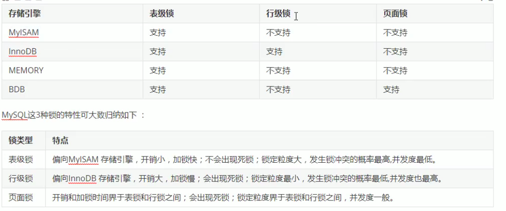

#### 锁概述

锁是计算机协调多个进程或者线程并发访问某一资源的机制（避免争抢）

#### 锁分类

从对数据操作的粒度分：

1. 表锁： 操作时，锁定整张表

2. 行锁： 操作时，锁定当前操作行

从对数据操作的类型分：

1. 读锁(共享锁)：正对同一份数据，多个读操作可以同时进行而互不影响

2. 写锁(排它锁)：当前操作没完成之前，会阻塞其他读写操作

#### 互斥锁
互斥锁特点：
一次只能一个线程拥有互斥锁，其他线程只有等待

#### Mysql锁

* [MyISAM](MyISAM.md) 
* [InnoDB](InnoDB.md) 

