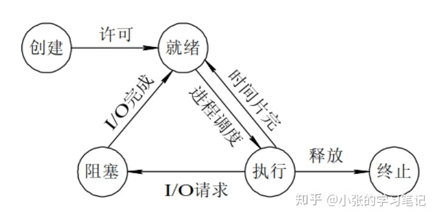

## 线程和进程
线程和进程的关系：线程是进程的基本执行单元, 一个进程的所有任务都在线程中执行。进程要想执行任务, 必须得有线程, 进程至少要有一条线程

- 区别：

   地址空间：同一进程的线程共享本进程的地址空间, 而进程之间则是独立的地址空间。

   资源拥有：同一进程内的线程共享本进程的资源如内存、I/O、cpu等, 但是进程之间的资源是独立的

### 进程间通信的方式有：

一、管道

管道, 通常指无名管道, 是 UNIX 系统IPC最古老的形式。

特点：

它是半双工的（即数据只能在一个方向上流动）, 具有固定的读端和写端。

它只能用于具有亲缘关系的进程之间的通信（也是父子进程或者兄弟进程之间）。

它可以看成是一种特殊的文件, 对于它的读写也可以使用普通的read、write 等函数。但是它不是普通的文件, 并不属于其他任何文件系统, 并且只存在于内存中。

二、FIFO

FIFO, 也称为命名管道, 它是一种文件类型。

1、特点

FIFO可以在无关的进程之间交换数据, 与无名管道不同。

FIFO有路径名与之相关联, 它以一种特殊设备文件形式存在于文件系统中。

三、消息队列

消息队列, 是消息的链接表, 存放在内核中。一个消息队列由一个标识符（即队列ID）来标识。

特点

消息队列是面向记录的, 其中的消息具有特定的格式以及特定的优先级。

消息队列独立于发送与接收进程。进程终止时, 消息队列及其内容并不会被删除。

消息队列可以实现消息的随机查询,消息不一定要以先进先出的次序读取,也可以按消息的类型读取。

四、信号量

信号量（semaphore）与已经介绍过的 IPC 结构不同, 它是一个计数器。信号量用于实现进程间的互斥与同步, 而不是用于存储进程间通信数据。

特点

信号量用于进程间同步, 若要在进程间传递数据需要结合共享内存。

信号量基于操作系统的 PV 操作, 程序对信号量的操作都是原子操作。

每次对信号量的 PV 操作不仅限于对信号量值加 1 或减 1, 而且可以加减任意正整数。

支持信号量组。

五、共享内存

共享内存（Shared Memory）, 指两个或多个进程共享一个给定的存储区。

特点

共享内存是最快的一种 IPC, 因为进程是直接对内存进行存取。

因为多个进程可以同时操作, 所以需要进行同步。

信号量+共享内存通常结合在一起使用, 信号量用来同步对共享内存的访问。

进程有五种状态：

- 创建状态：进程在创建时需要申请一个空白PCB, 向其中填写控制和管理进程的信息, 完成资源分配。如果创建工作无法完成, 比如资源无法满足, 就无法被调度运行, 把此时进程所处状态称为创建状态
- 就绪状态：进程已经准备好, 已分配到所需资源, 只要分配到CPU就能够立即运行
- 执行状态：进程处于就绪状态被调度后, 进程进入执行状态
- 阻塞状态：正在执行的进程由于某些事件（I/O请求, 申请缓存区失败）而暂时无法运行, 进程受到阻塞。在满足请求时进入就绪状态等待系统调用
- 终止状态：进程结束, 或出现错误, 或被系统终止, 进入终止状态。无法再执行

状态转换

### 父进程和子进程

正常情况下, 子进程是通过父进程创建的, 子进程再创建新的子进程。但是子进程的结束和父进程的运行是一个异步过程, 即父进程永远无法预测子进程到底什么时候结束。当一个进程完成它的工作终止之后, 它的父进程需要调用wait()或者waitpid()系统调用取得子进程的终止状态

### 僵尸进程和孤儿进程

#### 僵尸进程
当一个子进程结束运行（一般是调用exit、运行时发生致命错误或收到终止信号所导致）时, 子进程的退出状态（返回值）会回报给操作系统, 系统则以SIGCHLD信号将子进程被结束的事件告知父进程, 此时子进程的进程控制块（PCB）仍驻留在内存中。一般来说, 收到SIGCHLD后, 父进程会使用wait系统调用以获取子进程的退出状态, 然后内核就可以从内存中释放已结束的子进程的PCB；而如若父进程没有这么做的话, 子进程的PCB就会一直驻留在内存中, 也即成为僵尸进程

#### 孤儿进程

孤儿进程则是指当一个父进程退出, 而它的一个或多个子进程还在运行, 那么那些子进程将成为孤儿进程。孤儿进程将被init进程(进程号为1)所收养, 并由init进程对它们完成状态收集工作
