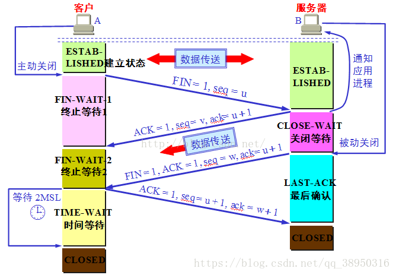
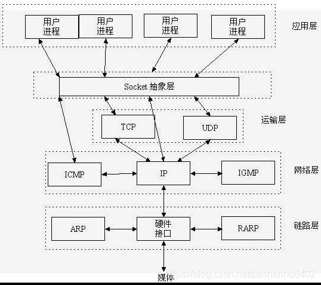

### TCP三次握手

1. 第一次握手（SYN）：客户端向服务器发送一个SYN（同步）请求，请求建立连接。此时客户端处于SYN_SEND状态。

2. 第二次握手（SYN+ACK）：服务器接收到客户端的SYN请求后，向客户端发送一个SYN+ACK（同步+确认）响应，表示已经收到了客户端的请求，并准备好建立连接。此时服务器处于SYN_RECV状态。

3. 第三次握手（ACK）：客户端接收到服务器的SYN+ACK响应后，向服务器发送一个ACK（确认）响应，表示已经收到了服务器的确认，并准备好传输数据。此时客户端处于ESTABLISHED状态，服务器也处于ESTABLISHED状态，表示连接已经建立。

建立连接的时候, 发送的包都不包含任何数据, 建立连接后才发送数据, 理想状态下, TCP一旦创建, 在通信双方中的任何一方主动关闭连接之前, TCP都会一直连接下去

优点：

1. 可以建立可靠连接：确保客户端和服务端是连接可靠的

2. 避免资源浪费：可以避免无效连接导致的资源浪费

3. 安全性高：只有在建立连接后才能传输数据

缺点：

1. 建立连接速度慢：需要3次确认才能建立连接

2. 占用资源：3次握手需要占用客户端和服务端资源，如带宽，cpu等

3. 可能被攻击：握手过程中可能会被利用进行攻击，例如SYN洪泛攻击，SYN泄露攻击等，这会导致服务端和客户端无法正常连接，影响网络的正常运行

#### 为什么是三次

TCP 协议的作用是, 保证数据通信的完整性和可靠性, 防止丢包

TCP作为一种可靠传输控制协议, 其核心思想：既要保证数据可靠传输, 又要提高传输的效率, 而用三次恰恰可以满足以上两方面的需求

#### 为什么不是两次

如果只是两次握手, 至多只有连接发起方的起始序列号能被确认, 另一方选择的序列号则得不到确认

#### tcp如何保证可靠传输

TCP主要提供了一下几种安全机制来保证数据的安全性和可靠性

1. 检验和

    TCP协议在发送数据前会对数据进行校验和计算，生成一个校验和，将这个校验和附加在数据包的头部。接收方在接收到数据包后，也会计算校验和，然后将计算得到的校验和与接收到的校验和进行比较，如果两者不一致，则说明数据可能已经被破坏或者发生了错误，接收方会丢弃这个数据包并发送重传请求。通过这种方式，TCP协议可以保证数据的完整性和可靠性
    
2. 序列号/确认应答

    TCP协议会为每个数据包分配一个唯一的序列号，接收方收到数据后，会发送一个确认应答ACK，以通知发送方数据已经正确接收。如果发送方没有收到确认应答ACK，则会重发数据包，直到收到确认应答ACK为止

3. 超时重传

    如果发送方没有收到确认应答ACK，则会定时重发数据包，直到收到确认应答ACK为止

4. 滑动窗口控制(流量控制)

    TCP协议在发送数据时，会根据接收方的接收能力设置一个滑动窗口大小。发送方在发送数据时，需要等待接收方的确认应答，确认接收到了数据包并提供了下一个期望接收的序列号，才能继续发送下一个数据包。通过这种机制，可以确保接收方可以处理自己能够处理的数据包，并且可以避免数据包的丢失或者超时等问题
 
5. 拥塞控制

    TCP协议通过拥塞控制机制来避免网络拥塞，保证网络的可靠性和公平性。发送方会根据网络的拥塞情况来调整发送速度，避免造成网络拥塞

### 四次挥手

1. 由客户端向服务器发送FIN报文, 请求断开连接, 序号为x。此时TCP数据包的标志位为FIN。
2. 服务器向客户端发送ACK报文, 表示收到了客户端发送的断开连接请求的数据包, 序号为y, 确认序号为x+1。此时TCP数据包的标志位ACK被设置为1
3. 服务器向客户端发送FIN包, 表示服务器向客户端发送结束请求包, 序号为y, 确认序号为x+1
4. 由客户端向服务器发送ACK报文, 表示收到服务器的结束请求包, 到这里所有流程走完, 服务器与客户端, 正式断开连接, TCP数据包的序号为x+1, 确认号为y+1

TIME_WAIT ：TCP 四次握手结束后, 连接双方都不再交换消息, 但主动关闭的一方保持这个连接在一段时间（2MSL两个最大报文生命周期时间）内不可用。

原因：

确保最后一个确认报文能够到达（如果B没收到A发送来的确认报文, 那么就会重新发送连接释放请求报文, A等待一段时间就是为了处理这种情况的发生）
避免新旧链接混淆。（等待2MSL可以让本连接持续时间内所产生的所有报文都从网络中消失, 使得下一个新的连接请求不会出现旧的连接请求报文）

优点:

1.可以防止旧连接数据包被错误地认为是新连接的数据包，从而保证连接的可靠性。

2.可以确保在TCP连接关闭后，双方的所有数据包都被完全传输，防止数据的丢失和混乱。

3. 可以确保连接被彻底关闭，避免出现类似于半开连接的情况，从而保证网络的稳定性

缺点：

1. TIME_WAIT状态会占用连接资源，降低系统的性能和吞吐量。

2. 如果同时打开的TCP连接数很多，TIME_WAIT状态的连接会占用大量的连接资源，从而导致连接池耗尽和连接的延迟。

3. TIME_WAIT状态的时长较长（通常为2MSL），可能会对系统的可用性和响应时间造成影响。

### UDP

UDP是传输层的协议, 功能即为在IP的数据报服务之上增加了最基本的服务：复用和分用以及差错检测

#### tpc 和 udp 的区别?

1. TCP面向连接(如打电话要先拨号建立连接);UDP是无连接的, 即发送数据之前 不需要建立连接 
2. TCP提供可靠的服务。也就是说, 通过TCP连接传送的数据, 无差错, 不丢失,  不重复, 且按序到达;UDP尽最大努力交付, 即不保证可靠交付 
3. TCP面向字节流, 实际上是TCP把数据看成一连串无结构的字节流;UDP是面向 报文的, UDP没有拥塞控制, 因此网络出现拥塞不会使源主机的发送速率降低 
4. 每一条TCP连接只能是点到点的;UDP支持一对一, 一对多, 多对一和多对多的 交互通信 
5. TCP首部开销20字节;UDP的首部开销小, 只有8个字节 
6. TCP的逻辑通信信道是全双工的可靠信道, UDP则是不可靠信道

### OSI 七层协议

1. 应用层(数据): 确定进程之间通信的性质以满足用户需要以及提供网络与用户应用
2. 表示层(数据): 主要解决拥护信息的语法表示问题, 如加密解密
3. 会话层(数据): 提供包括访问验证和会话管理在内的建立和维护应用之间通信的机制, 如服务器验证用户登录便是由会话层完成的
4. 运输层(段): 实现网络不同主机上用户进程之间的数据通信, 可靠与不可靠的传输, 传输层的错误检测, 流量控制等
5. 网络层(包): 提供逻辑地址（IP）、选路, 数据从源端到目的端的传输
6. 数据链路层(帧): 将上层数据封装成帧, 用MAC地址访问媒介, 错误检测与修正
7. 物理层（比特流）：设备之间比特流的传输, 物理接口, 电气特性等

### TCP/IP 四层协议

1. 应用层（TELNET、FTP、SMTP、HTTP）
2. 运输层（TCP、UDP）
3. 网际层（IP、ICMP）
4. 网络接口层（PPP）

### socket

Socket是什么

Socket是应用层与TCP/IP协议族通信的中间软件抽象层, 它是一组接口。在设计模式中, Socket其实就是一个门面模式, 它把复杂的TCP/IP协议族隐藏在Socket接口后面, 对用户来说, 一组简单的接口就是全部, 让Socket去组织数据, 以符合指定的协议

Socket=Ip address+ TCP/UDP + port